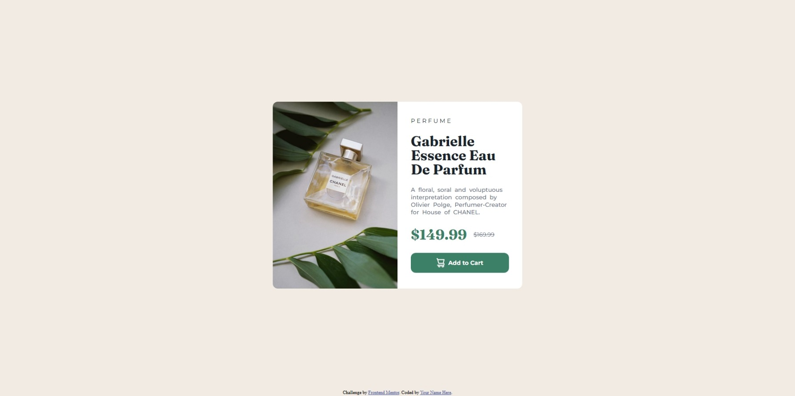

# Frontend Mentor - Product preview card component solution

This is a solution to the [Product preview card component challenge on Frontend Mentor](https://www.frontendmentor.io/challenges/product-preview-card-component-GO7UmttRfa). Frontend Mentor challenges help you improve your coding skills by building realistic projects. 

## Table of contents

- [Overview](#overview)
  - [The challenge](#the-challenge)
  - [Screenshot](#screenshot)
  - [Links](#links)
- [My process](#my-process)
  - [Built with](#built-with)
  - [What I learned](#what-i-learned)
  - [Continued development](#continued-development)
- [Author](#author)

## Overview

The Project is to design the Product view card created using the HTML and CSS. with a image of product and product details including the category of the product, product anme, product discription, price and an add to cart button.

### The challenge

Users should be able to:
- View the optimal layout depending on their device's screen size
- See hover and focus states for interactive elements

### Screenshot



### Links

- Solution URL: [View Source Code](https://github.com/FA23BCS233/responsive-product-card)
- Live Site URL: [Visit the Site](https://your-live-site-url.com)

## My process

In this project I aimed for the mobile first approach and created the product card for the mobile and then change the view to desktop and adjusted the CSS for it while doing this I added the line conflicting with the destop view in the media query this helped me to make the page naturally resposive writing as much as less media queries as I can which I think will optimize my code and performance of the web site.

### Built with

- Semantic HTML5 markup
- CSS custom properties
- Flexbox
- Mobile-first workflow


### What I learned

I learn how to make the resposive design with minimum efforts. In the CSS part I was stucked at the flex box behaviour where it was shrinking the size of the image then I realized the problem and add the flex-shrink: 0; property to make the image of the size I needed.

To see how you can add code snippets, see below:

```html
<main>
    <div class="product-card">

      <!-- Image Container -->
      <div class="image-container">
        <picture>
          <source srcset="./images/image-product-mobile.jpg" width="600px" media="(max-width: 600px)">
          
        </picture>
      </div>

      <!-- Discription Container -->
      <div class="description-container">

        <span class="product-category">PERFUME</span>
        <h2 class="product-name">Gabrielle Essence Eau De Parfum</h2>
        <p class="product-description">A floral, soral and voluptuous interpretation composed by Olivier Polge, Perfumer-Creator for House of CHANEL.</p>
        <div class="product-price">
          <span class="sale-price">$149.99</span>
          <span class="regular-price"><strike>$169.99</strike></span>
        </div>

        <button class="add-to-cart" aria-label="add-to-cart">
          
          Add to Cart
        </button>
      </div>
    </div>
  </main>
```
```css
main{
    width: 100%;
    min-height: calc(100vh - 15px);
    display: flex;
    align-items: center;
    justify-content: center;
    font-size: 14px;
    font-size: 500;
    padding: 10px;
}

.product-card{
    width: clamp(300px , 90% , 600px );
    background-color:  var(--white);
    overflow: hidden;
    display: flex;
    border-radius: 12px;
}

.image-container{
    width: clamp(300px, 50% , 400px);
    height: 450px;
    flex-shrink: 0;
    overflow: hidden;
}

.image-container img{
    width: 100%;
    height: 100%;
    object-fit: cover;
}

.description-container{
    padding: 32px;
    display: flex;
    flex-direction: column;
    gap: 12px;
    justify-content: space-around;
}

.product-category{
    font-family: montserrat;
    letter-spacing: 4px;
    font-size: 700;
    color: var(--black);
}

.product-name{
    font-family: fraunces;
    font-size: 34px;
    font-weight: 700;
    line-height: 34px;
    color: var(--black);
}

.product-description{
    font-family: montserrat;
    color: var(--grey);
    font-weight: 500;
    font-size: 14px;
    word-spacing: 4px;
}

.product-price{
    display: flex;
    align-items: center;
    gap: 16px;
}

.sale-price{
    font-family: fraunces;
    font-size: 34px;
    font-weight: 700;
    color: var(--green-500);
}

.regular-price{
    color: var(--grey);
    font-size: 14px;
    font-family: montserrat;
}

.add-to-cart{
    width: 100%;
    display: flex;
    align-items: center;
    justify-content: center;
    background-color: var(--green-500);
    border: none;
    border-radius: 12px;
    height: 48px;
    gap: 8px;
    color: white;
    font-size: 14px;
    font-family: montserrat;
    font-weight: 700;
}

.add-to-cart:hover{
    background-color: var(--green-700);
}

.add-to-cart img{
    width: 20px;
}

.attribution {
    height: 15px;
    font-size: 11px;
    text-align: center;
}
.attribution a {
    color: hsl(228, 45%, 44%);
}


@media (max-width: 600px) {
    .product-card{
        flex-wrap: wrap;
    }

    .image-container{
        width: 100%;
    }
}
```

### Continued development

Currently I am following the learning paths on the frontend mentors and solving the problem available here although I already know the full stack web development  but I did not had the confidence due to lack of projects.


## Author

- Name - [Muhammad Arham](#)
- Frontend Mentor - [@FA23BCS233](https://www.frontendmentor.io/profile/FA23BCS233)

